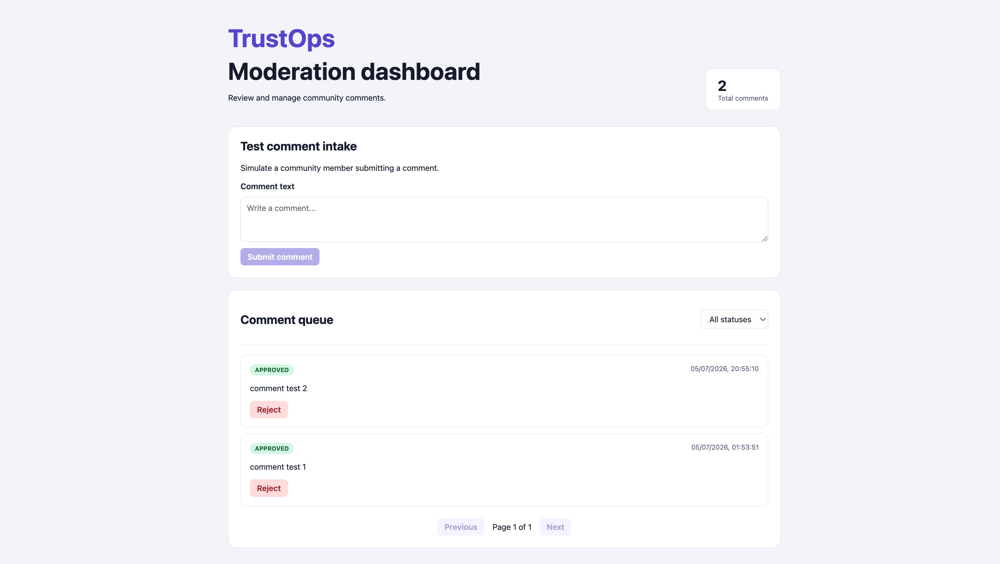
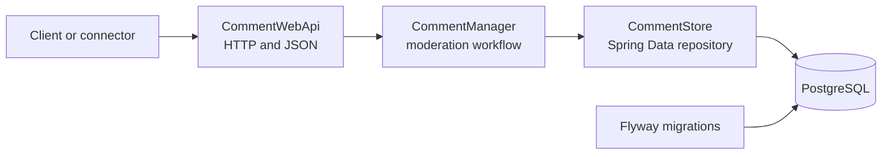
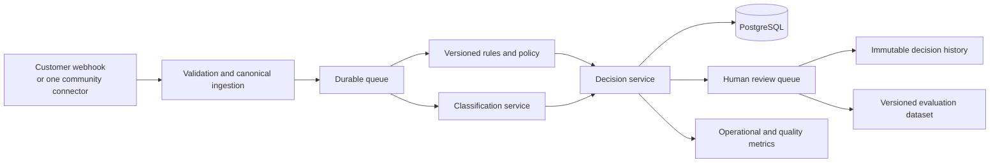

# TrustOps

**A human-in-the-loop moderation operations platform for online communities that have outgrown keyword bots.**

TrustOps is designed to help community teams process high message volumes without handing permanent moderation decisions to an opaque model. Incoming content is prioritised for review, moderators remain in control, and every eventual decision should be traceable to the content, policy, model version, and human action that produced it.

> **Current milestone:** TrustOps now supports authenticated, organisation-owned comment ingestion. Customer systems can send events using an API key, while tenant-scoped event identities and PostgreSQL constraints prevent repeated webhook deliveries from creating duplicate comments.

## Moderation dashboard



The workflow:

- submit comments through the browser;
- view the newest comments first;
- filter by moderation status;
- approve or reject comments;
- move through paginated results;
- display loading, empty, and error states;
- preserve decisions in PostgreSQL after refreshing.

## Why TrustOps exists

Small moderation teams can be overwhelmed during product launches, livestreams, or coordinated abuse campaigns. Basic blocked-word bots help with obvious spam, but they struggle with context:

- quoted abuse may be incorrectly removed;
- mild profanity may be harmless while targeted harassment is not;
- scam links and repeated messages need different handling from toxicity;
- immediate automatic bans make false positives difficult to reverse or explain.

TrustOps takes a different approach:

1. Accept content from a customer-owned product or community connector.
2. Assess it using deterministic rules and versioned model predictions.
3. Apply organisation-specific policy to decide what requires review.
4. Place risky content into a prioritised human review queue.
5. Record the final action and the evidence that led to it.

The guiding product decision is deliberate: **AI prioritises work; humans approve destructive actions.**

## What works today

The current application implements a complete local vertical slice of the moderation workflow:

### Backend
- REST API for ingesting comments;
- PostgreSQL persistence;
- `PENDING`, `APPROVED`, and `REJECTED` moderation states;
- moderator status updates;
- retrieval by comment ID;
- status filtering;
- newest-first ordering;
- paginated review queues with a capped page size;
- request validation and useful `400`/`404` responses;
- versioned database creation with Flyway;
- Docker Compose development environment;
- health endpoint;
- authenticated company ingestion using API keys;
- API keys stored as SHA-256 hashes instead of raw secrets;
- organisation ownership attached to ingested comments;
- external event identity using source and external ID;
- duplicate-event protection enforced by PostgreSQL;
- race-safe handling when identical events arrive simultaneously;
- unit and full HTTP integration tests;

### Frontend
- React and TypeScript moderation dashboard;
- browser-based comment submission;
- status filtering and pagination;
- approve and reject actions;
- responsive dashboard layout;
- frontend API and user-workflow tests.

### Current request flow



```text
POST /api/v1/comments
→ validate incoming JSON
→ create a PENDING comment
→ save it in PostgreSQL
→ return the stored comment as JSON
```

## Current API

| Method | Endpoint | Purpose |
|---|---|---|
| `POST` | `/api/v1/comments` | Ingest a comment. |
| `GET` | `/api/v1/comments` | Retrieve the paginated review queue. |
| `GET` | `/api/v1/comments?status=PENDING&page=0&size=20` | Filter and paginate by status. |
| `GET` | `/api/v1/comments/{id}` | Retrieve one comment. |
| `PATCH` | `/api/v1/comments/{id}/status` | Approve or reject a comment. |
| `GET` | `/actuator/health` | Check application health. |
| `POST` | `/api/v1/ingestion/comments` | Authenticated ingestion from a customer system. |

Authenticated company ingestion:

```bash
curl -X POST "http://localhost:8080/api/v1/ingestion/comments" \
  -H "Content-Type: application/json" \
  -H "X-API-Key: trustops-dev-key" \
  -d '{
    "source": "GENERIC_WEBHOOK",
    "externalId": "company-comment-1001",
    "text": "Please review this customer comment"
  }'

Create a comment:

```bash
curl -X POST "http://localhost:8080/api/v1/comments" \
  -H "Content-Type: application/json" \
  -d '{"text":"Please review this message"}'
```

Review pending comments:

```bash
curl "http://localhost:8080/api/v1/comments?status=PENDING&page=0&size=20"
```

Approve a comment:

```bash
curl -X PATCH "http://localhost:8080/api/v1/comments/{id}/status" \
  -H "Content-Type: application/json" \
  -d '{"status":"APPROVED"}'
```

## Technology and engineering choices

### Implemented

| Technology | Role | Why it is here |
|---|---|---|
| Java 21 and Spring Boot 4 | Backend application | Strong typing, validation, dependency injection, and production-oriented web/database support. |
| Spring Data JPA | Persistence boundary | Keeps workflow code separate from routine database access. |
| PostgreSQL 17 | Source of truth | Durable relational storage with constraints, indexing, and transactional behaviour. |
| Flyway | Schema history | Makes database changes explicit, ordered, and repeatable. |
| Docker Compose | Local infrastructure | Gives contributors the same PostgreSQL setup without manual database installation. |
| JUnit and Mockito | Automated tests | Verify moderation decisions without requiring the real repository in unit tests. |
| Spring Boot Actuator | Health reporting | Exposes application health for local checks and future deployment monitoring. |

### Planned, when justified by the workload

| Technology or capability | Intended role |
|---|---|
| React and TypeScript | Moderator review queue, policy controls, audit timeline, and operational metrics. |
| OIDC and role-based access | Organisation administrators, moderators, and read-only viewers. |
| Generic signed webhooks | Reliable ingestion from customer-owned products before adding many platform-specific connectors. |
| Durable queue and worker | Accept events quickly, retry failures, and keep model latency away from ingestion requests. |
| Python inference service | Isolate model loading and classification from the web backend. |
| Redis | Short-lived policy cache and rate-limit state, never the only copy of customer data. |
| OpenTelemetry | Correlated logs, metrics, traces, and service-level measurements. |
| GitHub Actions and cloud deployment | Repeatable testing and delivery. |

The project intentionally does **not** begin with Kafka, Kubernetes, GraphQL, automatic bans, or many shallow social connectors. Those tools add operational cost without solving the current milestone's problem.

## Target system design



TrustOps uses an **at-least-once ingestion model**. Customer systems may deliver the same event more than once, so TrustOps identifies events using the organisation, source, and external ID. A PostgreSQL uniqueness constraint provides final protection against duplicate storage, including when identical requests arrive simultaneously.

## Roadmap

### Phase 1 — Persistent moderation API

- [x] Comment ingestion API
- [x] PostgreSQL persistence
- [x] Flyway schema migration
- [x] Human moderation states
- [x] Filtering, ordering, and pagination
- [x] Health endpoint
- [x] Unit-tested moderation workflow
- [x] HTTP integration tests and continuous integration
- [ ] Structured API error format

### Phase 2 — Multi-tenant control plane

- [x] Users and organisations
- [ ] OIDC sign-in
- [ ] Administrator, moderator, and viewer roles
- [x] Tenant ID on every customer-owned record
- [ ] Application-level tenant checks and PostgreSQL row-level security
- [x] Hashed API keys for customer-owned integrations

### Phase 3 — Reliable ingestion

- [x] Canonical content-event schema independent of any platform
- [x] Authenticated generic webhook endpoint
- [x] Tenant-scoped idempotency keys
- [ ] Database protection against simultaneous duplicate deliveries
- [ ] Durable queue, retries, exponential backoff, and dead-letter handling
- [ ] One real connector after the generic webhook is reliable
- [ ] Recorded connector fixtures and contract tests

### Phase 4 — Classification and policy

- [ ] Separate Python inference service
- [ ] Baseline toxicity classifier with documented limitations
- [ ] Deterministic URL, repetition, and spam rules
- [ ] Per-organisation review thresholds
- [ ] Versioned model and policy records
- [ ] Distinguish `safe`, `flagged`, and `classification unavailable`
- [ ] Offline precision, recall, false-positive, calibration, and latency evaluation

### Phase 5 — Human review and auditability

- [x] React/TypeScript moderation dashboard
- [ ] Prioritised review queue
- [x] Approve, remove, and incorrect-prediction actions
- [ ] Reviewer notes and reversible actions
- [ ] Immutable audit timeline containing input hash, scores, matched rules, model version, policy version, reviewer, and timestamps
- [ ] Daily workload and false-positive statistics

### Phase 6 — Production readiness

- [ ] Per-tenant rate limits and processing quotas
- [ ] Structured logs and OpenTelemetry traces/metrics
- [ ] Queue-age, error-rate, connector-health, and model-latency alerts
- [ ] CI/CD and infrastructure as code
- [ ] Load, retry-storm, poison-message, and tenant-isolation tests
- [ ] Backup/restore and deletion-compliance exercises
- [ ] Deployed pilot with measurable reliability and reviewer-workload results

## Reliability and security questions the design must answer

TrustOps is being built around failure cases rather than only the happy path:

- What happens when a webhook delivers the same event twice?
- Can content from one organisation ever be returned to another?
- What happens when classification succeeds but persistence fails?
- How is a poison message prevented from retrying forever?
- Can one high-volume tenant starve every other tenant?
- How are old events reprocessed with a new model without overwriting history?
- How does the system distinguish non-toxic content from model unavailability?
- How are OAuth tokens, webhook secrets, and API keys stored safely?
- How are false positives measured across language and context?
- How can an audit trail be retained while honouring deletion requests?

These questions drive future implementation and testing; the README does not claim they are solved yet.

## Repository structure

```text
.
├── README.md
├── docs/
│   └── trustops-dashboard.png
├── backend/
│   ├── compose.yaml
│   ├── pom.xml
│   └── src/
└── frontend/
    ├── package.json
    ├── vite.config.ts
    └── src/
        ├── api/
        ├── components/
        ├── test/
        ├── App.tsx
        └── types/
```

## Run locally

Requirements:

- Java 21 or newer
- Docker Desktop
- Node.js and npm

Start PostgreSQL and the backend:

```bash
cd backend
docker compose up -d
./mvnw spring-boot:run
```

In another terminal, start the frontend:

```bash
cd frontend
npm install
npm run dev
```

Open:

```text
http://localhost:5173
```

Run the backend tests:

```bash
cd backend
./mvnw test
```

Run the frontend checks:

```bash
cd frontend
npm run lint
npm test
npm run build
```

Check backend health:

```bash
curl "http://localhost:8080/actuator/health"
```

Stop local infrastructure:

```bash
cd backend
docker compose down
```

Use `docker compose down -v` only when intentionally deleting the local PostgreSQL data volume.

## Current limitations
The current milestone is a local backend foundation, not an internet-ready moderation service:

- company ingestion is authenticated, but moderator users, roles, and tenant-scoped dashboard access are not implemented yet;
- ingestion is a direct synchronous API call;
- comments are manually reviewed and are not classified by AI;
- the dashboard is currently local and has not been deployed publicly;
- there is no durable queue, retry policy, audit ledger, or connector;
- returning JPA entities directly is acceptable for the current slice but will be replaced with explicit API response models as the contract grows.

These limitations are explicit so future work can be evaluated against real engineering goals rather than hidden behind a polished UI.

